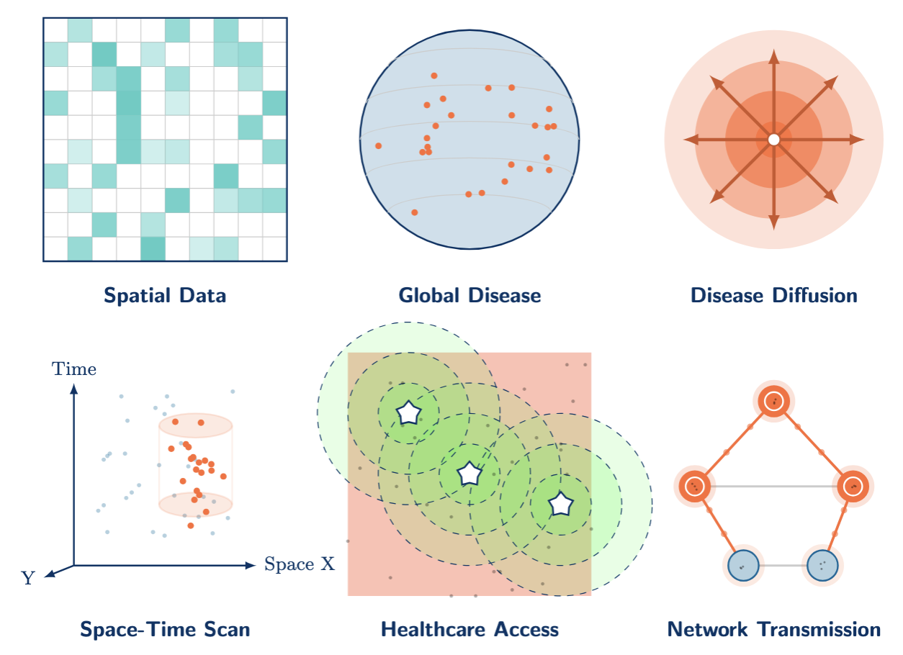

[In Person]{.in-person} \| [Online]{.online}

### Meeting 1 [Thu Jan 22, 9:00--10:00]{.in-person}: Orientation & Project Launch

-   Class expectations, learning outcomes
-   Discussion of the different concepts of spatial epidemiology
-   Open discussion

### Meeting 2 [Thu Jan 31, 10:00--11:00]{.online}: Geocoding Fundamentals

-   Units of analysis, MAUP, and spatial thinking
-   Geocoding accuracy: positional error and match rates
-   Disclosure risk and privacy protection methods
-   Aggregation, suppression, and geomasking (jittering, donut masking)
-   HIPAA and ethical frameworks for spatial health data
-   [GITHUB Link](https://spatialepilehigh.github.io/geocodingGeomaskingHIPAA/)

### Meeting 3 [Mon Feb 2, 6:00--7:00]{.online}: More on Privacy & Resolution Impact

-   Geocoding positional error: magnitude, patterns, and spatial clustering
-   Impact on spatial analysis: nearest neighbors, cluster detection, and statistical power
-   HIPAA privacy-utility tradeoff: 28% systematic error and geographic bias
-   Power reduction when disease and geocoding failure are associated
-   Research needs and policy recommendations (standardized tools, HIPAA reform, reporting standards)
-   [GITHUB Link](https://spatialepilehigh.github.io/GeocodingAccuracyPrivacyProtection)
-   [Exercise 1: Hands-on application of geocoding and geomasking concepts]{style="color: #667eea;"}
    -   [quarto link](https://github.com/SpatialEpiLehigh/exercise1/blob/main/ex1.qmd)
    -   [GITHUB link](https://spatialepilehigh.github.io/exercise1)

### Meeting 4 [Thu Feb 12, 9:00--10:00]{.in-person}: Disease Mapping & Rate Stabilization

-   From crude rates to stable estimates: dealing with small numbers
-   Expected counts, Standardized Mortality/Morbidity Ratios (SMR)
-   Empirical Bayes and Bayesian smoothing methods
-   Mapping choices and visual communication
-   [Exercise 2 demonstrated]{style="color: #667eea;"}
-   **Deliverable:** Exercise 1 draft outputs (internal vs. public map)

### Meeting 5 [Tue Feb 17, 9:00--10:00]{.online}: Autocorrelation

-   Spatial autocorrelation: Global Moran's I
-   Local Indicators of Spatial Association (LISA)
-   Multiple testing and significance mapping challenges
-   [Exercise 3 demonstrated]{style="color: #667eea;"}
-   **Deliverable:** Exercise 2: Preliminary crude rate, SMR, and EB maps; initial diagnostics

### Meeting 6 [Thu Feb 26, 9:00--10:00]{.in-person}: Cluster Detection

-   Cluster detection vs. clustering: key distinctions
-   Scan statistics and spatial scanning methods
-   Parameter sensitivity and cluster interpretation
-   What clusters mean (and don't mean) for public health action
-   [Exercise 4 demonstrated]{style="color: #667eea;"}
-   **Deliverable:** Exercise 3 is due (rate workflow + LISA map + interpretation memo)

### Meeting 7 [Thu Mar 5, 9:00--10:00]{.online}: Bias in Spatial and Temporal Data

-   Bias and MAUP in cluster detection
-   Population-at-risk considerations
-   Temporal caveats and communicating uncertainty
-   **Deliverable:** Exercise 4 is due: Cluster method selected; parameters justified; preliminary output

### Meeting 8 [Mon Mar 16, 6:00--7:00]{.online}: Spatial Accessibility

-   Accessibility concepts: catchments, impedance, and distance decay
-   Two-Step Floating Catchment Area (2SFCA) methods
-   Equity framing: identifying underserved populations
-   [Exercise 5 demonstrated]{style="color: #667eea;"}
-   **Deliverable:** Final cluster map + interpretation (addressing scale sensitivity and multiple testing)

### Meeting 9 [Wed Mar 25, 6:30--7:30]{.online}: Spatial Accessibility (cont'd)

-   Sensitivity to methodological parameters (thresholds, decay functions)
-   Modifiable catchment area problems
-   **Deliverable:** Preliminary access scores and map; underserved areas identified

### Meeting 10 [Thu Apr 2, 9:00--10:00]{.online}: Spatial Flows & Interaction

-   Origin-Destination (OD) tables and desire lines
-   Scaling, filtering, and visualizing flows
-   Identifying hubs and corridors
-   MAUP considerations in flow mapping
-   [Exercise 6 (flows) demonstrated]{style="color: #667eea;"}
-   **Deliverable:** Final accessibility outputs + short policy memo paragraph

### Meeting 11 [Thu Apr 9, 9:00--10:00]{.in-person}: Spatial Flows & Interaction (cont'd)

-   Interpreting spatial interaction patterns
-   Dominant corridors and connectivity
-   Modifiable zoning issues and visualization pitfalls
-   **Deliverable:** Preliminary OD table + draft flow map (desire lines or aggregated flows)

### Meeting 12 [Thu Apr 16, 9:00--10:00]{.in-person}: Spatial Regression

-   When OLS/GLM fails: residual spatial autocorrelation
-   Spatial lag vs. spatial error models
-   Spatially lagged covariates and fixed effects
-   Distinguishing spatial structure from spillover effects
-   [Exercise 7 demonstrated]{style="color: #667eea;"}
-   **Deliverable:** Exercise 6 is due: Final flow visualization + interpretation (hubs, corridors, scale effects)

### Meeting 13 [Mon Apr 20, 6:00--7:00]{.online}: Spatial Regression (cont'd)

-   Model comparison and interpreting coefficient changes
-   Writing methods and results sections for spatial analysis
-   Limitations, threats to validity, and reproducibility
-   **Deliverable:** Exercise 7 is due: Baseline model + residual Moran's I; spatial modeling strategy selected; Model comparison table

### Meeting 14 [Thu Apr 30, 9:00--10:00]{.in-person}: Geostatistics

-   Point support vs. area support in spatial prediction
-   Inverse Distance Weighting (IDW) vs. kriging
-   Variogram interpretation and prediction uncertainty
-   Sampling design considerations
-   [In-class exercise on geostatistics]{style="color: #667eea;"}
-   **Deliverable:** Draft manuscript due for feedback

### Date TBD: Final Presentations

-   **Deliverable:** Presentations
-   **Deliverable:** Submission-ready manuscript + target journal selection

------------------------------------------------------------------------

[delmelle\@gmail.com](mailto:delmelle@gmail.com)
